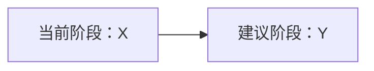

# 强制六阶段工作流技能（支持研究后快速完成）

## 职责边界

- 本技能是“新需求处理”的唯一流程入口。
- 本技能负责：阶段推进、阶段门禁、汇报格式、回退策略。
- 本技能不替代工具类技能；检索、通知与 Go 约束仍由对应技能承载。

## 默认关联技能（相对当前文件路径）

- 代码检索：`../../skills-internal/mcp-search-context`。
- 通知触发：`../../skills-internal/mcp-notify`。
- Golang 指南：`../../skills-internal/golang-guidelines`。
- Golang 模式：`../../skills-internal/golang-patterns`。
- API 设计：`../../skills-internal/api-design`。

## 全局强制约束

- 始终使用中文交流和回复。
- 查找或搜索代码时，优先使用 `mcp search_context`。
- 默认按固定顺序执行：`研究 -> 构思 -> 计划 -> 执行 -> 优化 -> 评审`。
- 受控例外：仅允许在研究阶段获得用户明确确认后进入`快速完成`并结束任务。
- 禁止基于“任务简单/紧急/常见”这类主观判断自动进入`快速完成`。
- 除“研究后快速完成”与“用户明确终止任务”外，不得跳过任一阶段。
- 每个阶段都必须先完成“阶段内任务”，再执行：`mcp notify -> 阶段总结 -> 请求反馈 -> 等待反馈`。
- 未收到用户明确反馈前，禁止进入下一阶段。
- 用户反馈不明确时，必须停留在当前阶段并发起澄清。
- 阶段输出必须以 `[模式：X]` 开头，且单条回复只允许一个模式标签；`快速完成`也适用。
- 冲突豁免：当本技能规则与更高优先级指令（系统/开发者/用户）冲突时，以更高优先级指令为准。

## 起点与顺序规则

- 新需求默认从 `[模式：研究]` 开始。
- 新需求首条回复只能进行研究阶段的需求理解与确认，不得直接给出`快速完成`结果。
- 在研究阶段总结并等待反馈后，若用户明确选择，可进入 `[模式：快速完成]`。
- `[模式：快速完成]` 必须满足“三条件”才可触发：`已完成研究阶段总结` + `已给出包含快速完成的反馈选项` + `收到用户下一条消息中的明确同意`。
- `[模式：快速完成]` 仅允许从 `[模式：研究]` 进入，不允许从其他阶段进入。
- 不允许未经确认的跨阶段跳转。
- 仅当用户在当前阶段反馈中明确同意时，才可进入下一阶段。

## 阶段状态机（强制）

| 当前阶段 | 允许的下一步                     | 触发条件                                                                                   |
| -------- | -------------------------------- | ------------------------------------------------------------------------------------------ |
| 研究     | 研究 / 构思 / 快速完成 / 终止    | 用户要求补充理解 / 用户确认理解正确 / 用户明确要求快速完成 / 用户明确终止                  |
| 快速完成 | 终止                             | 完成执行并输出最终总结                                                                     |
| 构思     | 构思 / 计划 / 终止               | 用户要求重提方案 / 用户选定方案 / 用户明确终止                                             |
| 计划     | 计划 / 执行 / 终止               | 用户要求改计划 / 用户批准计划 / 用户明确终止                                               |
| 执行     | 执行 / 优化 / 评审 / 计划 / 终止 | 用户要求修复执行结果 / 用户同意优化 / 用户跳过优化进评审 / 用户同意回退计划 / 用户明确终止 |
| 优化     | 优化 / 执行 / 评审 / 终止        | 用户要求重提优化项 / 用户批准执行优化 / 用户拒绝优化并进评审 / 用户明确终止                |
| 评审     | 评审 / 计划 / 执行 / 终止        | 用户要求补充评审 / 用户要求进入新一轮整改 / 用户明确终止                                   |

## 模式执行手册

### 研究模式（`[模式：研究]`）

- 目标：完整复述需求并确认边界、输入输出、约束与风险。
- 动作：指出不确定项与假设，形成统一问题定义。
- 阶段完成标准：用户确认“需求理解正确”，并选择“进入构思”或“快速完成”。

### 快速完成模式（`[模式：快速完成]`）

- 目标：在研究阶段确认无误后，跳过后续阶段直接完成任务。
- 动作：直接实施最小必要改动或直接给出最终产出，不再进入构思/计划/优化/评审。
- 限制：仅允许在研究阶段结束后由用户明确选择触发。
- 完成标准：输出最终结果与最终总结并结束任务。

### 构思模式（`[模式：构思]`）

- 目标：给出至少 2 个可执行方案。
- 动作：比较优缺点、风险、适用场景、实现路径与成本。
- 阶段完成标准：用户明确选择一个方案。

### 计划模式（`[模式：计划]`）

- 目标：将已选方案拆解为可审批的执行步骤。
- 动作：细化到文件、函数/类、关键逻辑、预期结果、风险与回滚点。
- 阶段完成标准：用户明确批准计划。

### 执行模式（`[模式：执行]`）

- 目标：按批准计划实施改动。
- 动作：只执行计划内事项；发现偏差时先汇报并请求回退/调整。
- 阶段完成标准：用户确认执行结果并决定进入优化或评审。

### 优化模式（`[模式：优化]`）

- 目标：提出并确认可量化收益的优化动作。
- 动作：识别冗余、性能、可维护性、规范性问题并给出收益说明。
- 阶段完成标准：用户批准执行优化或明确拒绝并进入评审。

### 评审模式（`[模式：评审]`）

- 目标：对照需求与计划做最终验收结论。
- 动作：总结完成度、残留风险、后续建议。
- 阶段完成标准：用户确认结束，或要求进入下一轮整改（回到计划/执行）。

## 阶段汇报模板（每阶段必须使用）

每次阶段结束后，必须先调用 `mcp notify`，再按以下结构输出：

````markdown
[模式：X]

## 📌 本阶段总结

- 已完成：...
- 关键结论：...
- 风险与阻塞：...

> 也可按内容复杂度改用表格呈现，无需固定为列表。

## 🧭 阶段流转（按需）



## 🚦 建议下一步

- 建议进入：[模式：Y]
- 理由：...

## ✅ 反馈选项

1. ...
2. ...

## ⏳ 等待反馈

请回复选项编号（如 `1`）或给出明确指令；在收到你的确认前，我不会进入下一阶段。
````

附加要求：

- 阶段汇报必须使用 Markdown 格式组织内容。
- 应适当使用 emoji 强化可读性，但应克制、语义明确，避免堆砌或喧宾夺主。
- 应根据内容复杂度自行判断使用列表、表格或二者结合；不强制每次同时使用两者。
- 当信息是状态汇总、字段对比、结果对照时，优先考虑表格；当信息是建议、行动项、反馈选项或线性说明时，优先考虑列表。
- 当存在阶段切换、回退路径、分支决策或多方案对比时，应按需补充 Mermaid 流程图；若流程极其简单且流程图不能提升可读性，可省略。
- 除评审模式外，反馈选项不少于 2 个，且必须从 `1` 开始连续编号。
- 研究模式的反馈选项必须包含“进入构思”与“快速完成”。
- 评审模式可提供“结束/整改”选项；若用户未确认结束，继续等待反馈。
- 不得只给选项不做总结；也不得只做总结不给选项。
- 快速完成模式为终态：调用 `mcp notify` 后输出最终总结，可不提供反馈选项。

## 反馈判定规则

- 可进入下一阶段的有效反馈：
  - 明确编号选择（如 `1`、`2`）。
  - 明确文本指令（如“进入计划阶段”）。
  - 研究阶段中的“快速完成”仅接受两类明确反馈：
    - 选择“快速完成”对应的编号选项（例如研究阶段中该选项是 `2`，则用户回复 `2`）。
    - 明确文本指令（如“直接快速完成”“走快速模式”“进入快速完成”）。
- 无效或不明确反馈（如“继续吧”“你看着办”）：
  - 必须先澄清，并停留在当前阶段。
- 对“快速完成”特别约束：以下表述一律视为未同意，不得触发快速完成：
  - 含糊推进（如“继续”“可以”“按你说的来”）。
  - 仅表达效率诉求（如“尽快处理”“简单做一下”）但未明确选择快速完成。
- 用户提出与当前阶段冲突的新要求：
  - 先总结冲突点，再提供回退或重规划选项，等待确认。

## 执行步骤（操作清单）

1. 识别当前所处阶段；若是新需求，固定进入 `[模式：研究]`。
2. 仅执行当前阶段允许的动作，不预执行下一阶段任务。
3. 当前阶段任务完成后，调用 `mcp notify`。
4. 按“阶段汇报模板”输出总结和反馈选项。
5. 停止并等待用户反馈。
6. 仅当研究阶段总结后的下一条用户反馈明确选择“快速完成”时，进入 `[模式：快速完成]` 并直接完成任务。
7. 其他场景下，仅在反馈有效时切换阶段；否则留在当前阶段澄清。

## 禁止行为

- 未经用户确认，自动进入下一阶段。
- 在同一条回复中输出多个阶段内容。
- 以“任务简单”为由跳过研究、构思或计划。
- 未总结直接给选项，或未给选项直接进入下一阶段。
- 在未获批准时执行计划外改动。
- 未经研究阶段确认，擅自进入快速完成模式。
- 将“继续吧”“按你说的来”等含糊反馈解释为快速完成同意。
